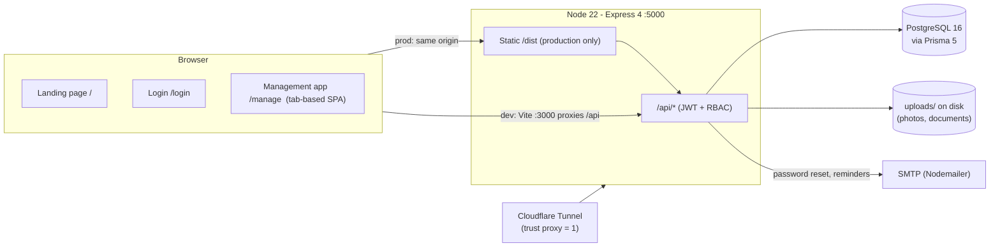
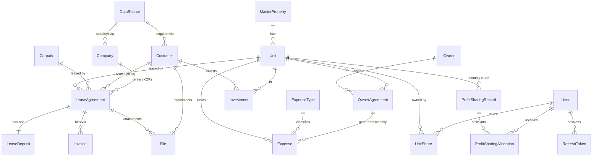
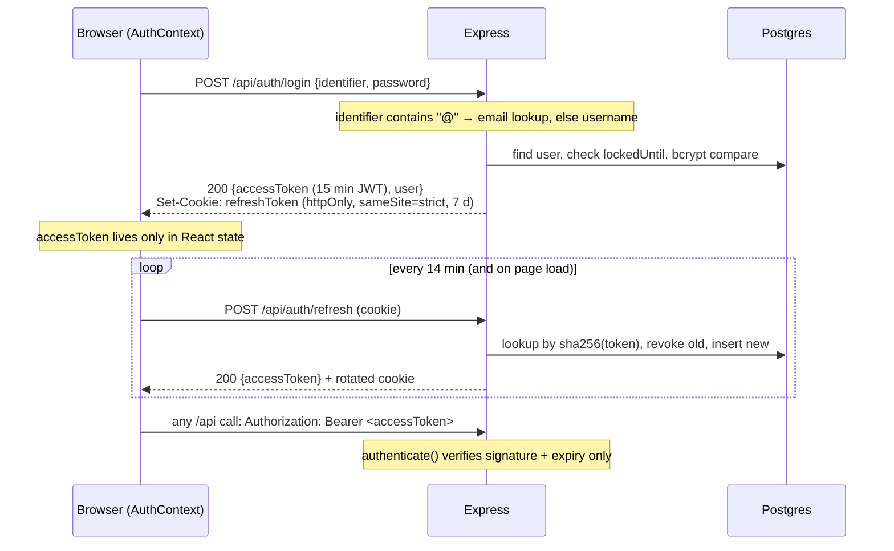
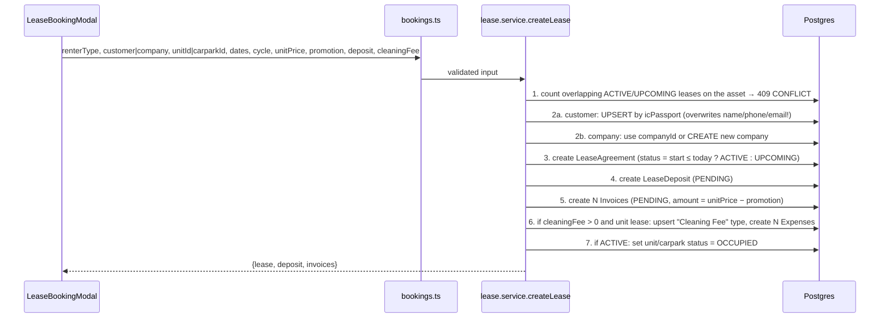
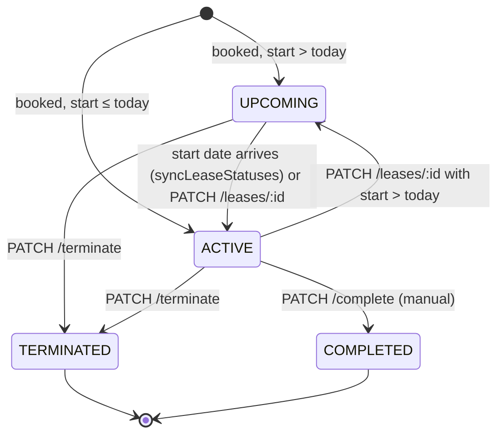
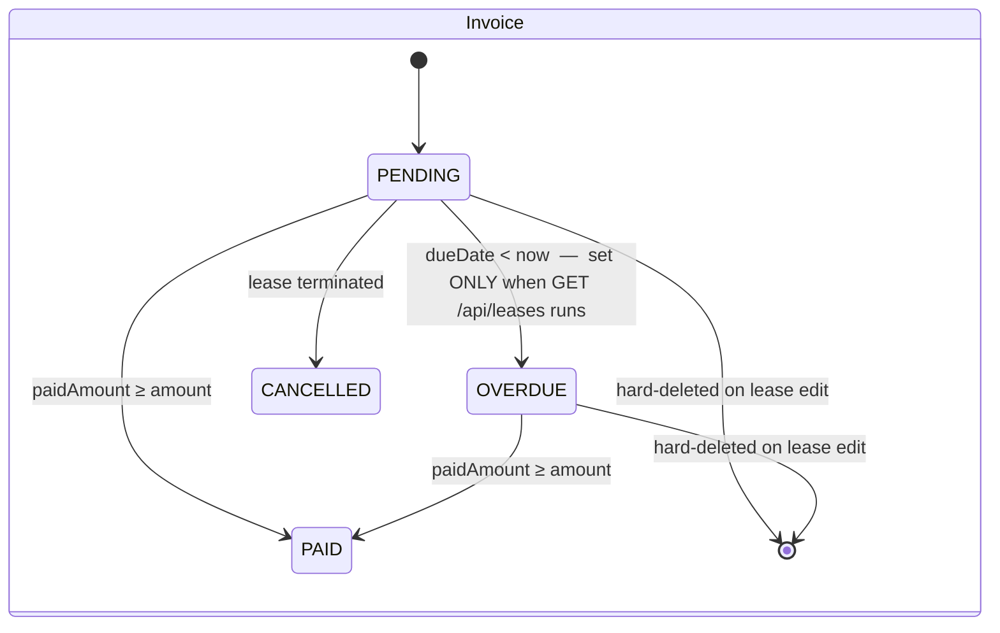
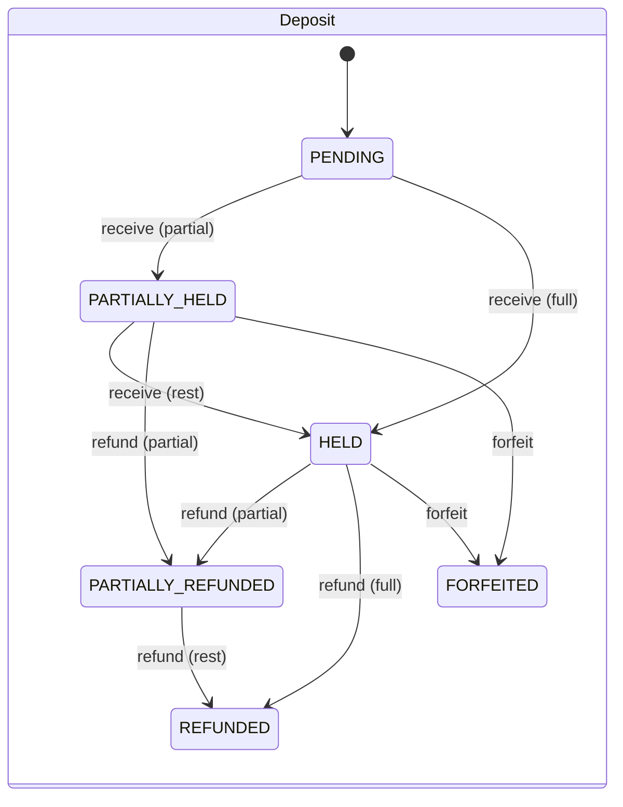
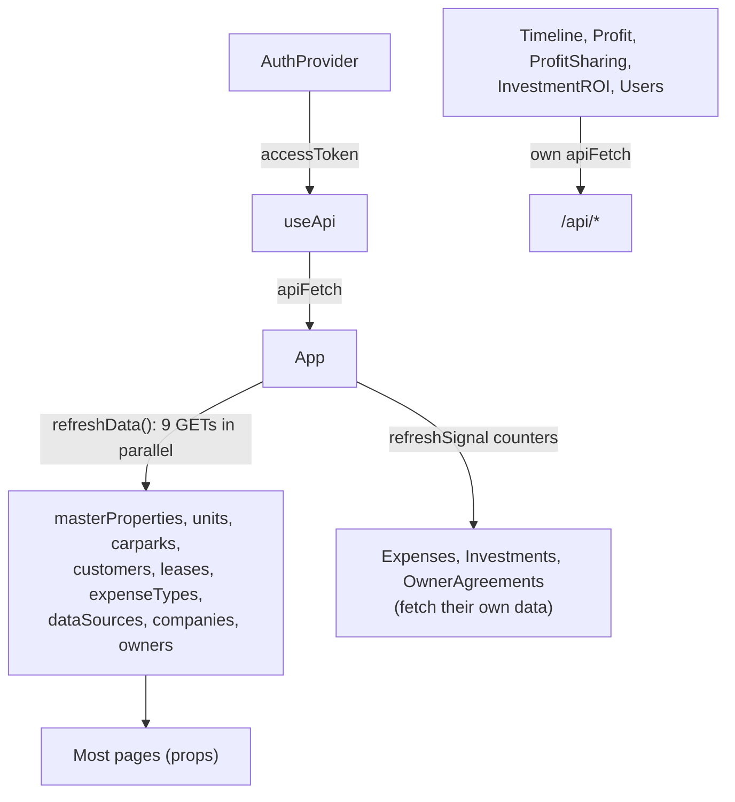

# VersaHome PMS — System Design Guide

> **Audience:** developers, reviewers, and operators who need to understand how this system is built and where it will bite them.
> **Companion documents:** [`AI_CONTEXT.md`](./AI_CONTEXT.md) is the same knowledge reorganised for AI coding agents (rules, invariants, recipes). [`../CLAUDE.md`](../CLAUDE.md) is the short project-instructions file that Claude Code loads automatically.
> **Accuracy:** everything here was verified by reading the source at commit `3a2e7b8` (Sept 2026). Where a claim comes from reading rather than running the code, the text says so.

If you read only one section, read **§9 Handle With Care**.

---

## Table of contents

1. [What the system is](#1-what-the-system-is)
2. [System context](#2-system-context)
3. [Repository layout](#3-repository-layout)
4. [Domain model](#4-domain-model)
5. [Core flows](#5-core-flows)
6. [Frontend architecture](#6-frontend-architecture)
7. [Backend architecture](#7-backend-architecture)
8. [Environments, build and deployment](#8-environments-build-and-deployment)
9. [⚠️ Handle with care — the special designs](#9-️-handle-with-care--the-special-designs)
10. [Known defects](#10-known-defects)
11. [FAQ](#11-faq)

---

## 1. What the system is

**VersaHome PMS** is an internal property-management system for a Kuala Lumpur rental operator (Versa Home Sdn Bhd). One deployment, one tenant, a handful of staff users. It manages:

| Area | What it tracks |
|---|---|
| **Assets** | Master properties (buildings) → units (rooms/apartments); carparks (independent of buildings) |
| **People** | Tenants as individual *Customers* or *Companies*; where each came from (*Data Sources*); property *Owners*; staff *Users* |
| **Leases** | A tenancy on one unit **or** one carpark, with generated invoices, a deposit, optional promotion discount and cleaning fee |
| **Expenses** | Per-unit costs, typed by an *Expense Type*; some are generated automatically (cleaning fees, owner payments) |
| **Owner agreements** | The rent the operator pays *to* a unit's owner each month — materialised as expenses |
| **Investments** | Capital an investor (a Customer) put into a unit, and a break-even analysis against that unit's cash profit |
| **Profit** | Cash-basis income vs. expenses, by property/unit/carpark and by month |
| **Profit sharing** | Percentage ownership of a unit by staff users, and monthly "cutoff" records that distribute that unit's final profit among them |

There is also a public marketing landing page (bilingual 中文/English) at `/`.

**Roles** (see §7.3): `VIEWER` < `MANAGER` < `ADMIN` < `SUPER_ADMIN`, plus `PROFIT_SHARING`, which sits *outside* the hierarchy and can see only the profit-sharing page for units it holds a share in.

---

## 2. System context



- **Development:** Vite dev server on `:3000` serves the React app and proxies `/api` to Express on `:5000` (`vite.config.ts`). Both start with `npm run dev`.
- **Production:** Express serves the built SPA from `dist/` and falls back every unknown path to `index.html` (`server/index.ts:100-106`). CORS is `origin: false` — only same-origin requests are accepted.

---

## 3. Repository layout

```
PMS/
├── prisma/
│   ├── schema.prisma          # the single source of truth for the data model
│   ├── migrations/            # applied with `prisma migrate deploy`; see §8.3 for oddities
│   └── seed.ts                # creates the SUPER_ADMIN user (idempotent)
├── server/                    # Express backend (ESM, run with tsx in dev, esbuild-bundled in prod)
│   ├── index.ts               # app wiring: helmet, CORS, cookies, rate limits, routers, static
│   ├── lib/
│   │   ├── prisma.ts          # singleton PrismaClient
│   │   └── email.ts           # Nodemailer transport + HTML templates
│   ├── middleware/
│   │   ├── authenticate.ts    # Bearer JWT → req.user = { userId, role }
│   │   └── authorize.ts       # role hierarchy + PROFIT_SHARING escape hatch
│   ├── routes/                # one file per resource; each exports an Express Router
│   └── services/
│       ├── auth.service.ts    # bcrypt, JWT, refresh-token rotation, lockout, reset tokens
│       ├── lease.service.ts   # conflict check, invoice generation, totals, createLease()
│       ├── ownerAgreement.service.ts  # monthly owner-payment expense generation / voiding
│       └── leaseStatus.service.ts     # the one scheduled job: activate due leases, flag overdue invoices
├── src/                       # React 19 + TypeScript + Tailwind 4 (Vite)
│   ├── main.tsx               # router: /, /login, /manage, * → /
│   ├── App.tsx                # the management shell: all shared state, handlers, modals, tab map
│   ├── contexts/AuthContext.tsx
│   ├── hooks/useApi.ts        # fetch wrapper that injects the Bearer token
│   ├── components/
│   │   ├── landing/           # marketing page sections
│   │   ├── layout/ManageSidebar.tsx   # ActiveTab type + nav
│   │   ├── manage/            # one modal per entity + LeaseBookingModal + LeaseDetailModal
│   │   └── common/
│   ├── pages/manage/          # one page component per tab
│   ├── i18n/                  # landing-page translations only
│   ├── types.ts               # frontend view of API response shapes
│   └── utils.ts
├── public/                    # static assets incl. QR codes and logo
├── docs/                      # ← you are here
├── CLAUDE.md                  # quick instructions for Claude Code
├── Dockerfile, docker-compose.yml, docker-compose.override.yml
└── .env.example
```

**Naming residue:** the project began as "StayFlow PMS" (`metadata.json`, the `stayflow` database name in `docker-compose.yml`). The product is now VersaHome; the old name survives only in those two places.

---

## 4. Domain model

### 4.1 Entity–relationship overview



### 4.2 Entity glossary

| Entity | Notes that matter |
|---|---|
| **MasterProperty** | A building. Soft-deleting it also soft-deletes its units (`assets.ts:90-112`). |
| **Unit** | `unitNumber` unique *per property*. Has `suggestedRentalPrice` (pre-fills bookings) and optional `guaranteeFee` (used only by profit sharing). `status` is VACANT / OCCUPIED / MAINTENANCE and is **maintained by lease code**, not by a scheduler (§9.1). |
| **Carpark** | `carparkNumber` globally unique. Not linked to a property; `unitNo` is a free-text remark. Carparks have no expenses, no owners, no profit sharing. |
| **Customer** | An individual tenant or investor. `icPassport` is globally unique and is the identity used for upsert during booking (§9.4). `customerNo` is a display-only serial. |
| **Company** | A corporate tenant. No unique natural key. |
| **DataSource** | Marketing channel (e.g. "Xiaohongshu"). Optional FK from Customer and Company. |
| **LeaseAgreement** | The central record. `customerId` **xor** `companyId`; `unitId` **xor** `carparkId` (enforced in code, not the schema). `totalAmount` is a *snapshot* computed at create/edit. `promotionAmount` is a per-period discount; `cleaningFee` is a per-period cost. Normally only `status` changes; `isActive = false` soft-deletes a lease booked by mistake, and is refused once any payment exists (§5.3). |
| **LeaseDeposit** | Exactly one per lease. Tracks `receivedAmount` / `refundedAmount` with six statuses. |
| **Invoice** | One per billing period. `amount` is already net of promotion. `paidAmount` supports partial payment; `status` becomes PAID only when fully paid. |
| **Expense** | Always belongs to a **unit**. `expenseDate` drives every report. `status`/`dueDate`/`paidAt`/`ownerAgreementId` exist for generated owner payments; ordinary expenses leave them at defaults. |
| **ExpenseType** | Named category. Two names are **magic** — `"Cleaning Fee"` and `"Owner Payment"` are upserted by name by generator code (§9.5). |
| **Owner / OwnerAgreement** | The landlord and the contract under which the operator pays them. Creating an agreement pre-generates one `Expense` per calendar month for its whole duration (§5.5). |
| **Investment** | Capital contributed by a Customer to a Unit. Status is manual (ACTIVE / MATURED / WITHDRAWN). |
| **UnitShare** | `(unitId, userId)` → percentage. Replaced wholesale on each save; total may be < 100 %. |
| **ProfitSharingRecord** | A saved monthly "cutoff" for one unit: snapshot of sales, expenses, guarantee fee, final profit. Unique on `(unitId, month, year)` and **write-once** — a second save is refused with 409 (§5.7). |
| **ProfitSharingAllocation** | The per-user split of a record, snapshotted at save time (including `userName`). |
| **User** | `username` is the required unique identifier; `email` is optional-unique. |
| **RefreshToken** | Hashed opaque tokens; rotated on every refresh. Rows are never purged. |
| **PasswordResetToken** | Hashed; 1-hour expiry; single-use. |
| **AuditLog** | **Defined in the schema but never written by any code.** |
| **File** | Upload metadata; the bytes live in `uploads/photos` or `uploads/documents` (chosen by MIME type). |

### 4.3 Soft delete vs. hard delete vs. status

This is one of the most important things to internalise:

| Mechanism | Applies to |
|---|---|
| **Soft delete** — `DELETE` sets `isActive = false`; every list query filters `isActive: true` | Customer, Company, DataSource, MasterProperty (+ its Units), Unit, Carpark, ExpenseType, Expense, Owner, OwnerAgreement, Investment, User (via `isActive` on update), LeaseAgreement (guarded — §5.3) |
| **Status only, never deleted** | LeaseDeposit, ProfitSharingRecord. A lease's own lifecycle is still `status` (UPCOMING / ACTIVE / TERMINATED / COMPLETED); deleting is the escape hatch for a mistaken booking, not a lifecycle step. |
| **Hard delete** | Invoice — but *only* as a side effect of editing a lease's dates/price (§9.6); File; UnitShare (replaced wholesale) |

Consequences:

- **Soft delete does not cascade across relations** (except property → units). Soft-deleting a unit leaves its leases, invoices and expenses live; the leases still appear in *Leases* but the unit disappears from *Timeline* and *Units*.
- The `onDelete: Cascade / Restrict / SetNull` clauses in `schema.prisma` only fire on **hard** deletes, which the API never issues for those models. Treat them as dormant.
- The "Delete data source" confirmation says linked customers will have their source cleared. They won't — the FK stays pointing at the inactive row (`SetNull` is a hard-delete behaviour).

---

## 5. Core flows

### 5.1 Authentication



Key properties (details in §9.9):

- The access token is **never persisted** — a hard reload triggers a silent refresh (`AuthContext.tsx:52-84`).
- Refresh tokens **rotate**; presenting a revoked or expired one revokes *every* refresh token for that user (`auth.service.ts:82-88`), which is a reuse-detection measure — a stale tab can log the user out everywhere.
- Five failed logins lock the account for 15 minutes.
- Password reset is email-only and the frontend pages for it **do not exist** (§10).

### 5.2 Booking a lease

`POST /api/bookings` → `createLease()` in `lease.service.ts`. Everything below happens in **one Prisma transaction**:



**Invoice period generation** (`generateInvoiceData`, `lease.service.ts:75-109`):

| Billing cycle | Invoices produced | Amount each | Due date |
|---|---|---|---|
| `DAILY` | exactly **one** covering the whole stay | `totalAmount` = days × (unitPrice − promotion), days inclusive of end date | start date |
| `MONTHLY` / `FIXED_TERM` | one per month-step from start until end | `unitPrice − promotion` | period start |

The month step is `new Date(y, m + 1, d)` in **server local time** — see §9.7 for why start days 29–31 drift.

**Total amount** (`calculateTotalAmount`): DAILY = inclusive day count; MONTHLY/FIXED_TERM = calendar-month difference (`(endY−startY)*12 + (endM−startM)`), with a floor of 1. Note this ignores the day-of-month, so a lease from 5 Jan to 4 Feb counts as 1 month and from 5 Jan to 6 Feb also counts as 1 month.

### 5.3 Lease lifecycle



Side effects on the **asset** (`unit.status` / `carpark.status`):

| Transition | Asset status |
|---|---|
| → ACTIVE (create or edit) | OCCUPIED |
| ACTIVE → UPCOMING (edit) | VACANT |
| → TERMINATED / COMPLETED | VACANT |

Nothing else touches asset status. `syncLeaseStatuses()` promotes UPCOMING → ACTIVE (and marks the asset OCCUPIED) once the start date arrives — see §9.1. **Completion is still manual**: a lease past its `endDate` stays ACTIVE with its unit OCCUPIED until someone terminates or completes it.

**Terminate** accepts an optional `terminationDate` (inclusive of both lease bounds). It sets `endDate` to that date and cancels **PENDING** invoices whose `periodStart` is after it. OVERDUE invoices are *not* cancelled (§9.6).

**Delete** (`DELETE /api/leases/:id`, MANAGER) is separate from the status lifecycle — it is the escape hatch for a booking entered by mistake, not a way to end a tenancy. It sets `isActive = false`, which hides the lease, its invoices and its deposit from every list, report and the timeline, and frees the asset to `VACANT` if the lease was ACTIVE. It is **refused with 409** when:

- any invoice is `PAID` **or** carries a partial `paidAmount` — deleting would rewrite already-reported income; terminate instead; or
- the deposit is `HELD` / `PARTIALLY_HELD` — refund or forfeit it first, so tenant money is accounted for.

Because the conflict check also filters `isActive`, a deleted lease stops blocking its dates and the asset can be re-booked immediately. **Cleaning-fee expenses generated at booking are not removed** — `Expense` has no `leaseId`, so they cannot be traced back; delete them from the Expenses page if needed (§9.3). Rows are never physically removed, so a mistaken delete is recoverable with a direct `UPDATE lease_agreements SET "isActive" = true`.

### 5.4 Invoice and deposit state machines





- Paying an invoice (`PATCH /api/invoices/:id/pay`) adds to `paidAmount`, caps it at `amount`, and only when the cap is reached sets `status = PAID` and `paidAt = now` (`leases.ts:579-590`). **Partial payments are invisible to every profit report** until the last payment lands, at which point the *full* amount is recognised on that date.
- Deposit **forfeit** takes an `amount` that means *"how much to give back"* — `0` is a full forfeit (`leases.ts:799-807`). The parameter name is the opposite of what you'd guess.
- Deposit `editAmount` is allowed in any state before refund/forfeit and preserves status even if `receivedAmount` now exceeds the new `amount`.

### 5.5 Owner agreements → expenses

`POST /api/owner-agreements` creates the agreement and, in the same transaction, **one `Expense` per calendar month** from the start month to the end month inclusive (`ownerAgreement.service.ts:17-56`):

- Expense type: upsert `"Owner Payment"` by name.
- `amount` = agreement amount; `expenseDate` = `dueDate` = the agreement's `paymentDay` in that month, clamped to the month's last day; `status = PENDING`; `ownerAgreementId` set.
- Dates are computed in **UTC**.

Later actions:

| Action | Effect on generated expenses |
|---|---|
| `PUT /owner-agreements/:id` (amount, dates, paymentDay) | **None.** Existing expenses keep old values. The UI says so. |
| `PATCH /owner-agreements/:id/terminate {terminationDate}` | Soft-deletes PENDING expenses with `dueDate > terminationDate`; sets `endDate`. |
| `DELETE /owner-agreements/:id` | Soft-deletes *all* PENDING expenses; soft-deletes the agreement. PAID ones remain. |
| `PATCH /expenses/:id/pay` | Marks one expense PAID with `paidAt = now`. Used from the Owner Agreements page. |

So the answer to "do I add the owner rental every month?" is **no** — it's generated once for the whole agreement (§11).

### 5.6 Money: how profit is computed

There is no stored ledger. Every report re-reads live rows. Three separate endpoints implement essentially the same rule with small differences:

| | `/api/profit` (+ `/monthly`, `/monthly/roomtype`) | `/api/investment-analysis` | `/api/profit-sharing/:unitId/calculate` & `/records` |
|---|---|---|---|
| **Income** | `Invoice.status = PAID` and **`paidAt`** in range → `amount` | same | `Invoice.status = PAID` and **`periodStart`** in range → `amount` (§5.7) |
| **Expenses** | `Expense.isActive` and `expenseDate` in range → `amount`, **any status** | same | same |
| **Carparks** | carpark-lease invoices summed separately (no expenses) | n/a (units only) | n/a |
| **Month boundaries** | **UTC** (`Date.UTC`) | **UTC** | **UTC** (`monthBounds()`) |
| **Extra rule** | none | cumulative net since earliest investment start; break-even when cumulative ≥ total capital | guarantee fee (§5.7) and percentage split |
| **File** | `profit.ts` | `investmentAnalysis.ts` | `profitSharing.ts` |

Implications:

- Income is **cash basis** and dated by *when it was paid*, not the billing period. A January invoice paid in March is March income everywhere.
- Expenses are dated by `expenseDate` regardless of `status`. A PENDING owner payment for next month already counts as next month's expense. Cleaning-fee expenses created at booking time count in each period even if the lease is later terminated (they are not voided — §9.6).
- Editing a historical expense or re-paying an invoice **changes history** in all three reports. Only saved `ProfitSharingRecord` rows are frozen.
- Promotion is *not* an expense; it lowers invoice `amount`. The invoice PDF reconstructs gross = amount + promotion for display (`leases.ts:633-636`).

### 5.7 Profit sharing cutoff

For a unit, a month, and a year (`profitSharing.ts:191-318` live; `321-448` save):

```
totalSales    = Σ PAID invoice.amount with periodStart in month   ← billing period, NOT payment date
totalExpenses = Σ active expense.amount with expenseDate in month
netProfit     = totalSales − totalExpenses
guaranteeFee  = unit.guaranteeFee ?? 0
finalProfit   = totalSales >= guaranteeFee ? netProfit : netProfit − guaranteeFee
allocations   = largestRemainder(finalProfit, unitShares)   // cents-exact, sums to finalProfit
```

The guarantee-fee rule deducts the **whole** fee whenever sales fall short of it — not the shortfall. If that is not the intended business rule, this is where to change it (`profitSharing.ts:247` and `:367`, duplicated).

**A cutoff is write-once.** `POST /records` creates the record and its allocations for that `(unit, month, year)` and a second save is refused with **409** — enforced by an existence check *and* by the unique constraint, so a stale page or a direct API call cannot overwrite it either. The UI reflects this: the button reads "Save Cutoff" and, once saved, becomes a disabled "Cutoff Saved" with the notes field locked.

This matters because a cutoff is the record of what was actually **paid out**. Recomputing it later would re-split a settled month using today's `UnitShare` percentages and leave no trace of the figures the owners received. Allocations snapshot `userName` **and** `percentage` at save time for the same reason.

The trade-off, accepted deliberately: a cutoff **cannot be corrected in the app**. If a September-period invoice is settled in October after September was cut off, the saved record stays at the lower figure — the live panel above it will disagree. Fixing a genuine mistake means deleting the row in the database. The figures shown above the button are always recalculated live; only the saved record is frozen.

A `PROFIT_SHARING` user can save a cutoff for any unit they hold a share in; only `MANAGER+` can edit the share percentages.

---

## 6. Frontend architecture

### 6.1 Routing and shell

`src/main.tsx` defines only three routes: `/` (landing), `/login`, `/manage` (protected). Everything inside the management app is a **tab**, not a route: `App.tsx` holds `activeTab` and renders `pageContent[activeTab]`. Adding a page means touching four places — the `ActiveTab` union and a `SidebarItem` in `ManageSidebar.tsx`, the `pageContent` map and any state/handlers in `App.tsx`.

`PROFIT_SHARING` users are pinned to the `profitSharing` tab in code (`App.tsx:57-64`) and see a reduced sidebar.

**Code splitting.** Three lazy boundaries keep the initial download small:

| Chunk | Size | Fetched when |
|---|---|---|
| `index` | ~413 kB | always (landing, login, router, shared libs) |
| `App` | ~248 kB | the user reaches `/manage` |
| `CartesianChart` (recharts) + the two chart pages | ~430 kB | the user opens Profit or Investment ROI |

Before this split every visitor to the public landing page downloaded all 1,089 kB — the whole admin app and the charting library — to read the marketing copy. Each boundary needs a `<Suspense>` fallback: `main.tsx` wraps `App`, and `App.tsx` wraps the `pageContent` map. `lazy()` needs a default export, so the named page exports are adapted with `.then(m => ({ default: m.X }))`.

### 6.2 Data flow



- **`App.tsx` is the state hub.** Nearly every mutation ends with `await refreshData()`, which re-fetches nine endpoints. Pages that own their data instead receive a `refreshSignal` number that increments to trigger their `useEffect`.
- **Modals are uncontrolled forms** read via `FormData` on submit. A `selectedX === null` means *create*, otherwise *edit* — the same handler builds the URL and method.
- **`useApi().apiFetch`** injects `Authorization` and always sets `Content-Type: application/json`. Because it is memoised on `accessToken`, its identity changes every 14 minutes, and any `useCallback`/`useEffect` that depends on it re-runs — pages silently refetch on token refresh.
- **Errors are `alert()`s, confirmations are `confirm()`s.** There is no toast system and **no React error boundary** — a render error blanks the whole app.

### 6.3 Dates on the client

Date inputs produce `YYYY-MM-DD` strings. `new Date('YYYY-MM-DD')` parses as **UTC midnight**; the server stores that instant. Display uses `toLocaleDateString('en-GB')` in the *browser's* zone. The whole app implicitly assumes users are at or east of UTC (Malaysia is UTC+8), where UTC midnight is still the same calendar day. A user west of UTC would see dates shifted one day earlier.

### 6.4 Two visual systems

The landing page uses design tokens declared in `src/index.css` under Tailwind 4's `@theme` (`bg-surface`, `text-primary`, `font-display`…). The management app uses plain Tailwind palette utilities (`bg-slate-50`, `text-indigo-600`). Don't mix them.

The landing page is the **only** place i18n exists (`src/i18n/`); the management app is English-only.

---

## 7. Backend architecture

### 7.1 Request pipeline

```
helmet → cors → cookieParser → json(1 MB) → urlencoded → trust proxy
  → globalLimiter (500/15 min prod, 2000 dev)
  → authLimiter on /login and /forgot-password (10/15 min prod, 50 dev)
  → router → [authenticate] → [authorize] → handler
```

`authenticate` (`middleware/authenticate.ts`) verifies the Bearer JWT and sets `req.user = { userId, role }`. It does **not** consult the database, so a deactivated user or a changed role keeps working until the token expires (≤ 15 min) — §9.9.

### 7.2 Route conventions

Every route file follows the same shape; copy it when adding one:

- Zod schema per body; `safeParse`; on failure `400 { error: issues[0].message }` (or `parsed.error.flatten()` in the lease routes).
- Prisma `Decimal` fields are converted with `Number()` before responding — clients never see Decimal objects.
- Prisma error codes map to HTTP: `P2002` unique → 409, `P2003` FK → 409/400, `P2025` not found → 404. Everything else → 500 with `console.error`.
- List endpoints filter `isActive: true` and usually return a trimmed projection rather than the raw row.
- Multi-row writes use `prisma.$transaction(async tx => …)`; services accept `tx` as a parameter so they can run inside the caller's transaction.
- Widespread `(prisma as any)` / `(prisma.x.findMany as any)` casts exist because the generated client is often stale in Docker builds (CLAUDE.md explains the two cast forms).

### 7.3 Authorisation

```ts
// middleware/authorize.ts
ROLE_HIERARCHY = { VIEWER: 1, MANAGER: 2, ADMIN: 3, SUPER_ADMIN: 4 }   // PROFIT_SHARING → 0
requireViewer | requireManager | requireAdmin | requireSuperAdmin      // numeric ≥
requireProfitSharingOrViewer   // PROFIT_SHARING  OR  level ≥ VIEWER
```

| Capability | Minimum role |
|---|---|
| Read anything in the management app | VIEWER |
| Create/edit/delete assets, people, leases, expenses, investments, owners; pay invoices; upload files; set unit shares | MANAGER |
| Send email reminders | ADMIN |
| Manage users | SUPER_ADMIN |
| Profit-sharing pages for units you hold a share in (read **and** save cutoffs) | PROFIT_SHARING |

`PROFIT_SHARING` fails `requireViewer` (level 0), so the only endpoints it can reach are the `/api/profit-sharing/*` routes, `/api/auth/me`, and — because it has no role check — `GET /api/upload/:id`.

### 7.4 Complete API surface

| Route | Methods | Role | Notes |
|---|---|---|---|
| `/api/auth/login`, `/refresh`, `/logout`, `/forgot-password`, `/reset-password` | POST | public | login by `identifier` (email or username) |
| `/api/auth/me` | GET | any authenticated | |
| `/api/auth/users`, `/users/:id` | GET, POST, PUT | SUPER_ADMIN | no DELETE — deactivate via `isActive:false` |
| `/api/assets/properties[/:id]` | GET, POST, PUT, DELETE | Viewer / Manager | delete cascades to units (soft) |
| `/api/assets/units[/:id]` | GET, POST, PUT, DELETE | Viewer / Manager | |
| `/api/assets/carparks[/:id]` | GET, POST, PUT, DELETE | Viewer / Manager | |
| `/api/customers[/:id]` | GET, POST, PUT, DELETE | Viewer / Manager | |
| `/api/companies[/:id]`, `/companies/search?q=` | GET, POST, PUT, DELETE | Viewer / Manager | |
| `/api/datasources[/:id]` | GET, POST, PUT, DELETE | Viewer / Manager | |
| `/api/inventory/timeline?startDate&endDate` | GET | Viewer | units + carparks + overlapping ACTIVE/UPCOMING leases |
| `/api/inventory/customers/search?q=` | GET | Viewer | name / phone / IC, max 10 |
| `/api/bookings` | POST | Manager | creates lease + deposit + invoices (+ cleaning expenses) |
| `/api/leases` | GET | Viewer | **side effect: marks past-due PENDING invoices OVERDUE** |
| `/api/leases/:id` | GET, PATCH, DELETE | Viewer / Manager | PATCH regenerates invoices when dates/price change. DELETE soft-deletes, refused once any invoice is paid or a deposit is held (§5.3) |
| `/api/leases/:id/terminate`, `/complete` | PATCH | Manager | |
| `/api/leases/:id/invoices` | GET, POST | Viewer / Manager | POST adds a manual invoice |
| `/api/leases/:id/files[/:fileId]` | GET, DELETE | Viewer / Manager | |
| `/api/invoices/:id` | PATCH | Manager | edit amount/period/due on PENDING/OVERDUE |
| `/api/invoices/:id/pay` | PATCH | Manager | partial or full payment |
| `/api/invoices/:id/pdf` | GET | Viewer | PDFKit stream |
| `/api/deposits/:id` | PATCH | Manager | `action: receive | refund | forfeit | editAmount` |
| `/api/expenses/types[/:id]` | GET, POST, PUT, DELETE | Viewer / Manager | |
| `/api/expenses[/:id]` | GET, POST, PUT, DELETE | Viewer / Manager | GET filters `unitId` / `propertyId` |
| `/api/expenses/summary` | GET | Viewer | property → unit → expenses |
| `/api/expenses/:id/pay` | PATCH | Manager | for generated owner payments |
| `/api/owners[/:id]` | GET, POST, PUT, DELETE | Viewer / Manager | |
| `/api/owner-agreements[/:id]` | GET, POST, PUT, DELETE | Viewer / Manager | POST generates monthly expenses |
| `/api/owner-agreements/:id/terminate` | PATCH | Manager | voids future PENDING expenses |
| `/api/investments[/:id]` | GET, POST, PUT, DELETE | Viewer / Manager | |
| `/api/investment-analysis[/:unitId]` | GET | Viewer | break-even series |
| `/api/profit?from&to&propertyId&unitId&carparkId` | GET | Viewer | cash-basis, defaults to current UTC month |
| `/api/profit/monthly?year`, `/monthly/roomtype?year` | GET | Viewer | 12-month series |
| `/api/profit-sharing/units`, `/shareable-users` | GET | PROFIT_SHARING or Viewer+ | units filtered to own shares for PROFIT_SHARING |
| `/api/profit-sharing/:unitId/shares` | GET, PUT | PROFIT_SHARING/Viewer+ read, **Manager** write | PUT replaces all shares |
| `/api/profit-sharing/:unitId/calculate?year&month` | GET | PROFIT_SHARING or Viewer+ | live numbers + saved record if any |
| `/api/profit-sharing/:unitId/records` | GET, POST | PROFIT_SHARING or Viewer+ | POST saves the cutoff **once**; 409 if one already exists |
| `/api/upload` | POST | Manager | multipart `file` + optional `customerId`, `leaseId`, `category` |
| `/api/upload/:id` | GET, DELETE | any authenticated / Manager | GET has **no role check** |
| `/api/reminders/rental`, `/lease` | POST | ADMIN | email tenants; **crashes on company leases** (§10) |
| `/api/health` | GET | public | |

---

## 8. Environments, build and deployment

### 8.1 Commands

```bash
npm run dev           # Vite :3000 + tsx watch server :5000
npm run lint          # tsc --noEmit — the ONLY automated check; there are no tests
npm run build         # Vite build → dist/
npm run db:migrate    # prisma migrate dev   (needs a reachable DB)
npm run db:deploy     # prisma migrate deploy
npm run db:seed       # tsx prisma/seed.ts — creates admin / admin@versahome.com.my; safe to re-run
```

### 8.2 Production image

Two-stage Alpine Dockerfile. Stage 1 runs `prisma generate`, `vite build`, and **esbuild** bundles `server/index.ts` → `dist/server/index.js` and `prisma/seed.ts` → `prisma/seed.mjs`. Stage 2 installs prod deps, runs `prisma generate` again (binary targets include `linux-musl-openssl-3.0.x`), copies `dist/`, creates `uploads/`.

**esbuild strips types without checking them.** A type error passes the Docker build and fails at runtime. Always run `npm run lint` before building.

`docker-compose.yml` runs the app on `127.0.0.1:5000` and Postgres 16 with database/user `stayflow`; `uploads` and `pgdata` are named volumes. `docker-compose.override.yml` moves the app to `:5001` and unpublishes the DB port so a git worktree can run beside the main checkout.

### 8.3 Migrations

Applied with `prisma migrate deploy`. Two things to know:

- `prisma/migrations/manual_customer_update.sql` is a stray empty file at the wrong level; Prisma ignores it. It can be deleted.
- `20260402145334_` (unnamed) is **destructive** — it dropped `emergencyContact`, `icNumber`, `nationality`, `notes`, `phone` from `customers` and added NOT NULL columns without defaults. It only ran cleanly because the table was empty at the time. Don't use it as a template.
- `20260509000002_username_primary` back-fills usernames from the email local-part and de-duplicates with a UUID suffix, then makes `username NOT NULL` and `email` nullable.

### 8.4 Environment variables

See `.env.example`. `JWT_ACCESS_SECRET` must be ≥ 32 chars. `CLIENT_URL` is used for CORS in dev and for the password-reset link. In production the cookie is `secure`, so cookie-based auth only works over HTTPS (or the Docker `localhost:5000` path per CLAUDE.md).

---

## 9. ⚠️ Handle with care — the special designs

These are the non-obvious decisions that will surprise you. Each entry says what the behaviour is, why it matters, where it lives, and what to do when you touch it.

### 9.1 Only two things advance with the clock — everything else is manual

There is exactly one scheduled job: `syncLeaseStatuses()` in `server/services/leaseStatus.service.ts`. It runs on server boot, hourly via `setInterval` in `server/index.ts`, and again at the top of `GET /api/leases` so the UI is correct the moment someone looks rather than up to an hour later. It is idempotent.

| State that depends on the clock | How it changes |
|---|---|
| `LeaseAgreement.status` UPCOMING → **ACTIVE** (+ asset OCCUPIED) | `syncLeaseStatuses()` — automatic. Also computed at create and at `PATCH /leases/:id`. |
| `Invoice.status` PENDING → **OVERDUE** | `syncLeaseStatuses()` — automatic. |
| `LeaseAgreement.status` ACTIVE → **COMPLETED** | **Manual** `PATCH /complete` only. A lease past its `endDate` stays ACTIVE and its unit stays OCCUPIED indefinitely. |
| `Unit.status` OCCUPIED → **VACANT** | Only on terminate / complete / delete (§5.3). Never by the end date passing. |
| `OwnerAgreement.status` → **COMPLETED** | Enum value exists; **no code sets it**. |
| `Investment.status` → MATURED | Manual edit only. |
| Expired `RefreshToken` rows | Never purged. |

**Why completion is deliberately excluded:** COMPLETED means an operator confirmed the tenancy ended and settled the deposit. That is a judgement call, not a date comparison, so the sync does not guess it. The consequence is the mirror of the bug it fixes — **a finished lease keeps its unit marked OCCUPIED until someone closes it**. If that becomes a problem, the decision to make is whether "end date passed" should auto-complete, auto-vacate the asset only, or just raise a warning in the UI.

**What to do:** the sync is the place for any new clock-driven rule. Keep additions idempotent — it runs on every Leases page load.

### 9.2 Profit is derived, three times, with two clocks

Covered in §5.6. The parts to be careful with:

- **Profit Sharing dates income by billing period; the other two date it by payment.** `profitSharing.ts` filters `Invoice.periodStart` into the month, so rent for a period starting 9 Sep counts in September even when paid on 10 Oct. `profit.ts` and `investmentAnalysis.ts` still filter on `paidAt`, so the same payment lands in October there. **The two will not reconcile** — this is intentional (requested Sept 2026), not a bug. All three now use UTC month boundaries.
- Because the paid-only rule was kept, a late payment changes what the **live panel** shows for a closed month: a September-period invoice settled on 10 October appears in September's recalculation. The **saved cutoff does not move** — it is write-once (§5.7) — so the two will disagree, and that disagreement is the intended signal that money arrived after the month was settled.
- **Expense status is ignored** by all three. Future PENDING owner payments count now.
- **Partial payments are invisible** until fully paid (§5.4).
- The guarantee-fee rule (§5.7) is duplicated in two handlers; change both.

**What to do:** if you change the definition of income or expenses, change it in all three files, and consider extracting a shared `profitFor(unitId, from, to)` — none exists today.

### 9.3 Generated rows: booking creates up to 2N+2 records

One booking = 1 lease + 1 deposit + N invoices + (0 or N) cleaning-fee expenses (§5.2). The cleaning-fee expenses are **ordinary expenses** with no back-reference to the lease (no `leaseId` on `Expense`). Once created they cannot be found again except by expense type + unit + date.

**What to do:** if a lease is edited or terminated, remember those expenses are not adjusted (§9.6). If you add a `leaseId` to `Expense`, backfilling is not possible for existing rows.

### 9.4 Booking upserts the customer by IC/passport — silently overwriting

`lease.service.ts:171-185`: `tx.customer.upsert({ where: { icPassport }, update: { name, phoneLocal, email? } })`. Booking a lease for an IC that already exists **overwrites** that customer's name and phone with whatever was typed in the booking form, with no warning. `currentAddress` is stored as `''` (not `null`) on create.

**What to do:** treat the booking form's customer fields as authoritative, or change the upsert to `create`-only with a lookup first. Never rely on the customer's stored name being the "original".

### 9.5 Magic expense-type names

`"Cleaning Fee"` (`lease.service.ts:257-264`) and `"Owner Payment"` (`ownerAgreement.service.ts:18-22`) are upserted **by `name`**. If someone renames the type in the UI, the next booking creates a fresh type with the old name. If someone soft-deletes it, the upsert still finds and reuses the inactive row (upsert ignores `isActive`), so generated expenses attach to a type that no longer appears in lists.

**What to do:** don't rename those two types. If you need to change the label, change the string constant in both services and migrate existing rows.

### 9.6 Editing or terminating a lease does not cleanly adjust what was generated

`PATCH /api/leases/:id` with a date or price change (`leases.ts:312-366`):

1. **Hard-deletes** every PENDING and OVERDUE invoice on the lease.
2. Regenerates invoices for the **entire** new period from scratch.
3. Keeps PAID and CANCELLED invoices untouched.

Consequences:
- If any invoice was already PAID and the dates move, the regenerated set can include a period that overlaps the paid one → **duplicate billing period**.
- Any manual edits made via `PATCH /invoices/:id` (adjusted amounts, due dates) or manually added invoices (`POST /leases/:id/invoices`) that are still PENDING are **lost**.
- **Cleaning-fee expenses are not touched** — they remain for the old periods and are not created for new ones.
- The customer/company, deposit, promotion and cleaning fee cannot be changed after booking.

`PATCH /api/leases/:id/terminate` (`leases.ts:160-172`) cancels only **PENDING** invoices after the termination date. An invoice that has already flipped to **OVERDUE** (because someone opened the Leases page) is **not cancelled** and keeps counting as receivable. Cleaning-fee expenses for the cancelled periods remain and keep counting as expenses.

**What to do:** before editing dates on a lease with paid invoices, look at the invoice list and expect to clean up by hand. If you fix the OVERDUE gap, add `'OVERDUE'` to the `status` filter at `leases.ts:161-164`.

### 9.7 Month stepping uses JavaScript date overflow, in local time

`generateInvoiceData` advances with `new Date(y, m + 1, d)` (`lease.service.ts:96`). For a start date on the 31st: Jan 31 → "Feb 31" → **Mar 3**, then Apr 3, … The periods drift and the lease can end up with one fewer invoice than months. Start days 29 and 30 have the same problem in February. The same function uses local-time getters, so results depend on the server's TZ.

Owner-agreement generation (`ownerAgreement.service.ts`) does this correctly — it walks `(year, month)` integers and clamps the day. Use that as the model if you fix invoices.

### 9.8 Timezone assumptions

- Server-side: `profit.ts`, `investmentAnalysis.ts`, `ownerAgreement.service.ts` → UTC. `lease.service.ts`, `leases.ts`, `profitSharing.ts`, `reminders.ts` → local. Docker runs UTC by default; a bare-metal server in MYT would behave differently in the second group.
- Client-side: `YYYY-MM-DD` → UTC midnight instant; displayed in browser zone (§6.3). Correct for MYT users, off-by-one for users west of UTC.

**What to do:** when adding date logic on the server, use `Date.UTC` / `getUTC*` consistently. On the client, keep sending plain `YYYY-MM-DD`.

### 9.9 Auth edge cases

- **Token payload is trusted for 15 minutes.** `authenticate` never re-reads the user. Deactivating a user (`PUT /users/:id {isActive:false}`) revokes refresh tokens but their current access token keeps working until expiry. Role changes likewise lag.
- **Refresh reuse detection is aggressive.** A second tab or a mobile app presenting an already-rotated token revokes *all* of that user's sessions (`auth.service.ts:82-88`).
- **Login lockout** is 5 failures / 15 minutes and the counter resets on success. The `/refresh` endpoint has no rate limit.
- **Users without an email cannot reset their password**, and the reset pages don't exist anyway (§10).
- **`GET /api/upload/:id` is not role-gated** — any valid token, including `PROFIT_SHARING`, can fetch any file by UUID.
- **Sidebar role logic:** `ManageSidebar.tsx:19` names the variable `isSuperAdmin` but it is true for `ADMIN` too, so ADMIN sees the *User Management* tab and gets 403 from the API. The user footer shows a hard-coded "Admin User / AD" (`:116-121`), not the logged-in user.

### 9.10 Frontend refresh storms and the `apiFetch` identity

`refreshData()` fires nine requests. It runs on mount and after almost every save/delete. `apiFetch` changes identity on every token refresh (every 14 min), so everything memoised on it re-runs — including `refreshData`. On a slow connection this is noticeable; on a large dataset it will become the bottleneck before anything else does.

Also: `apiFetch` **forces `Content-Type: application/json`**. `LeaseDetailModal.handleFileUpload` (`:411-425`) passes a `FormData` body through it. Per the Fetch spec a caller-supplied Content-Type is kept, so the browser sends `application/json` with a multipart body and multer will not parse it — the upload should fail with `400 No file uploaded`. This was determined by reading, not by running: **verify before relying on lease document upload**, and if it is broken, bypass `apiFetch` (or delete the header) for FormData requests.

### 9.11 Prisma `as any` and stale types

The codebase casts liberally because the generated client is frequently out of date in Docker builds. The rule from CLAUDE.md: for a new **field**, cast the call (`(prisma.unit.findMany as any)(…)`); for a new **model**, cast the client (`(prisma as any).owner.findMany(…)`). This means TypeScript will not catch misspelled field names in those calls — `npm run lint` passes and the query fails at runtime.

### 9.12 Deposit `forfeit` semantics are inverted

`PATCH /api/deposits/:id { action: 'forfeit', amount }` — `amount` is the portion **returned to the tenant**; `0` means "keep everything". It is stored in `refundedAmount`. Every other action's `amount` is the amount being *applied*.

### 9.13 `totalAmount` on a lease is a snapshot

It is computed at create and at date/price edit, and never recomputed when invoices are edited, added, or cancelled. Don't use it for anything financial; sum the invoices.

---

## 10. Known defects

Found while reading the code for this document. Each is verified against the source but **not** reproduced at runtime.

| # | Where | Defect | Effect |
|---|---|---|---|
| 1 | ~~`server/routes/reminders.ts` null-deref on company leases~~ | **Fixed** Sept 2026 — `resolveRecipient()` falls back to the company, tenants with no email are skipped and counted, and each send is individually try/caught so one bad address cannot abort the batch. | — |
| 2 | ~~`prisma/seed.ts` created the admin without `username`~~ | **Fixed** Sept 2026 — seeds `username: 'admin'` and matches on username **or** email so re-runs stay idempotent even if the email was later cleared. | — |
| 3 | `src/main.tsx` | No `/forgot-password` or `/reset-password` routes; the catch-all redirects to `/` | The login page's "Forgot password" link and the emailed reset link both land on the marketing page. Backend endpoints work; the UI does not exist. |
| 4 | `server/routes/leases.ts:161-164` | Terminate cancels only `PENDING` invoices | `OVERDUE` invoices after the termination date survive as open receivables. |
| 5 | `server/routes/leases.ts:334-354` | Date/price edit hard-deletes and regenerates invoices without reconciling PAID periods or cleaning-fee expenses | Duplicate periods next to paid invoices; orphaned cleaning-fee expenses; manual invoice edits lost. (§9.6) |
| 6 | `server/services/lease.service.ts:96` | Month stepping by `new Date(y, m+1, d)` | Periods drift for start days 29–31. (§9.7) |
| 7 | ~~`server/routes/profitSharing.ts` local-time month boundaries~~ | **Fixed** Sept 2026 — `monthBounds()` builds the window in UTC. | — |
| 8 | `src/components/layout/ManageSidebar.tsx:19`, `:96-101` | `ADMIN` is shown the User Management tab | API rejects with 403. |
| 9 | `src/components/manage/LeaseDetailModal.tsx:411-425` + `src/hooks/useApi.ts:11` | FormData sent with `Content-Type: application/json` | Lease document upload very likely fails with `400 No file uploaded`. Verify. |
| 10 | `server/routes/upload.ts:87` | `GET /api/upload/:id` has no `authorize` | Any authenticated role can download any file. |
| 11 | `prisma/schema.prisma:148-161` | `AuditLog` is never written | The table exists but is always empty; nothing is audited. |
| 12 | `package.json` | `jspdf`, `jspdf-autotable` unused; `@types/*` and `vite` in `dependencies` | Bloats the production image. |
| 13 | `README.md` | AI Studio boilerplate referencing `GEMINI_API_KEY` | Misleading for newcomers; this document supersedes it. |

---

## 11. FAQ

**Do I have to add the owner rental expense every month?**
No. Creating an Owner Agreement generates one PENDING "Owner Payment" expense for every calendar month of the agreement, up front (§5.5). You only mark each one paid when you pay the owner. Ordinary expenses (utilities, repairs) are one-off and must be entered each time. Cleaning fees are generated per billing period when the lease is booked.

**Why does an invoice show OVERDUE only after I open the Leases page?**
Because that page's API call is what marks them (§9.1).

**Why is my UPCOMING lease still UPCOMING although it started last week?**
Nothing promotes it. Open the lease, click Edit, and save — the PATCH recomputes status and sets the unit OCCUPIED (§5.3).

**I edited an owner agreement's amount; why are the old expenses unchanged?**
By design — regeneration on edit is not implemented (§5.5). Void and recreate the agreement, or edit the expenses individually.

**Why doesn't a half-paid invoice show up in Profit?**
Profit counts only invoices with `status = PAID`, which requires full payment (§5.4).

**A customer's name changed by itself.**
Someone booked a lease with that IC/passport and typed a different name (§9.4).

**Where are the tests?**
There are none. `npm run lint` (`tsc --noEmit`) is the only automated check.
